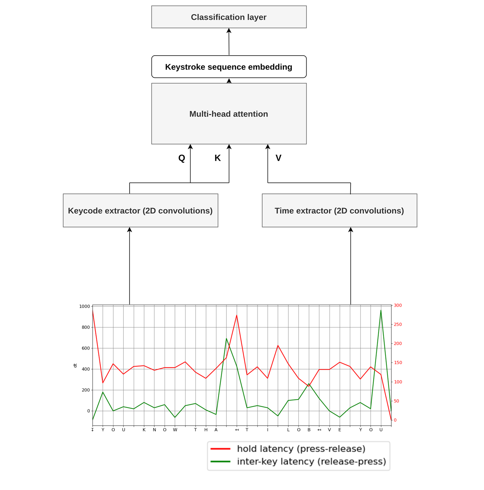

# Anabel-KA - Typing Biometrics with Keycode Attention


Anabel-KA is a neural network for the free-text keystroke analysis. It is a part of a larger toolbox for behavioural biometrics that is under construction. 

Our intention was to build a model that is able to do both: extract the keystroke dynamics features and transform them into the embedding that corresponds to the movement patterns that are described by the sequence of the buttons pressed on the keyboard. 
The Keycode Attention module in the proposed network help capture the relations between the keycodes in the typing sequence. 

The Keycode Attention is defined as the attention function, in which the attention matrix is computed from the keycode sequence, and values are derived from the sequence of typing time intervals. $Q$ and $K$ in the equation of scaled dot product attention are a result of the keycode extraction function $F_{KB}$ and $V$ is a result of the time-interval extraction function $F_{T}$.
Feature extraction is made using 2D convolutions with kernels of size 3.



 
## Input data
Aims to resolve the task from Keystroke Verification Challenge @ IEEE BigData 2023 (https://sites.google.com/view/bida-kvc/)

The raw data from KVC datasets contains sequences of ASCII keycodes and timestamps for the events of pressing and releasing the key. Input sequences are processed to obtain the relative time values: hold times (HT) and inter-key latencies (IK). Hold time (HT) is understood as the time between pressing and releasing the key and inter-key latency (IK) is the time between releasing the key and pressing the next one.

Hold and inter-key times have significantly different value ranges, therefore they are divided by a different scaling factor.


## Pretrained models


| Scenario        | Link to checkpoint |
| :------------- | :------------- |
|desktop | [AnabelKA_desktop_2023-10-29-224950-nfix.pkl](https://www.dropbox.com/scl/fi/1dqiy5miw8pvrnqyfh0l1/AnabelKA_desktop_2023-10-29-224950-nfix.pkl?rlkey=qdork0les59da5ids2hr16ewz&dl=0)|
|mobile | [AnabelKA_mobile_2023-10-29-215204-nfix.pkl](https://www.dropbox.com/scl/fi/vbfc7yf66wvo0aybirsd0/AnabelKA_mobile_2023-10-29-215204-nfix.pkl?rlkey=hhqpdzy6xozpbhnytmvazk42h&dl=0) |

## Requirements

```python
pip install -r  requirements.txt
```


## Training

```shell
python trainer.py --data_dir data --task desktop
```

